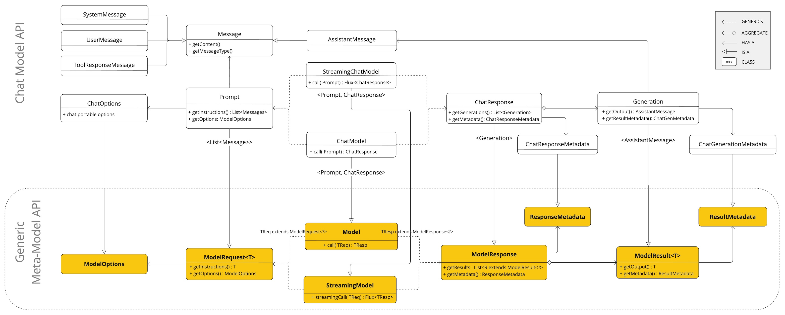

# 1. Chat Model API
> Spring AI는 AI 모델을 분류하고, 같은 분류에 속하는 모델들을 벤더사와 무관하게 통일된 방법으로 사용하기 위한 인터페이스를 제공하고 있다. 인터페이스를 통해 특정 모델에 종속되지 않게 응답을 처리할 수 있으며, 이로 인해 AI 모델 변경에 따른 애플리케이션 변경은 최소화 할 수 있게 된다.

| 모델 구분           | 설명                          | 주요 API          |
| --------------- | --------------------------- | --------------- |
| Chat Model      | Text, Image To Text 모델(LLM) | ChatModel       |
| Image Model     | Text To Image 모델            | ImageModel      |
| Audio Model     | TTS, STT                    | SpeechModel     |
| Embedding Model | Text To Vector 모델           | Embedding Model |
위 주요 모델 중, Chat Model은 AI 기반 대화 기능을 애플리케이션에 통합할 수 있도록 한다.

## 1.2 Chat Model


[Spring AI - Chat Model API](https://docs.spring.io/spring-ai/reference/api/chatmodel.html#_available_implementations)

```java
public interface ChatModel extends Model<Prompt, ChatResponse>, StreamingChatModel {  

	// 매개값으로 주어진 문자열, 메시지, 프롬프트로 LLM에 동기요청
    default String call(String message) {  
        Prompt prompt = new Prompt(new UserMessage(message));  
        Generation generation = this.call(prompt).getResult();  
        return generation != null ? generation.getOutput().getText() : "";  
    }  
    
    default String call(Message... messages) {  
        Prompt prompt = new Prompt(Arrays.asList(messages));  
        Generation generation = this.call(prompt).getResult();  
        return generation != null ? generation.getOutput().getText() : "";  
    }  
    
    @Override
    ChatResponse call(Prompt prompt);  
  
    default ChatOptions getDefaultOptions() {  
        return ChatOptions.builder().build();  
    }  
    
    default Flux<ChatResponse> stream(Prompt prompt) {  
        throw new UnsupportedOperationException("streaming is not supported");  
    }}
    
}

// 비동기 요청
@FunctionalInterface  
public interface StreamingChatModel extends StreamingModel<Prompt, ChatResponse> {  
  
    default Flux<String> stream(String message) {  
       Prompt prompt = new Prompt(message);  
       return stream(prompt).map(response -> (response.getResult() == null || response.getResult().getOutput() == null  
             || response.getResult().getOutput().getText() == null) ? ""  
                   : response.getResult().getOutput().getText());  
    }  
    default Flux<String> stream(Message... messages) {  
       Prompt prompt = new Prompt(Arrays.asList(messages));  
       return stream(prompt).map(response -> (response.getResult() == null || response.getResult().getOutput() == null  
             || response.getResult().getOutput().getText() == null) ? ""  
                   : response.getResult().getOutput().getText());  
    }  
    @Override  
    Flux<ChatResponse> stream(Prompt prompt);  
  
}
```

## 1.2 Prompt
ModelRequest 인터페이스의 구현체로, 복수 개의 시스템 메시지, 사용자 메시지, AI 메시지를 저장하고 대화 옵션을 가지고 있음.
```java
public class Prompt implements ModelRequest<List<Message>> {
	private final List<Message> messages;
	
	@Nullable
	private ChatOptions chatOptions;
}
```

## 1.3 Message
메시지는 아래의 메시지들로 구성되어 있음
- `SystemMessage`
	- LLM 요청 전 생성
	- LLM 행동과 응답 스타일을 지시하는 메시지로, LLM이 입력을 해석하는 방법과 답변하는 방식 지시
- `UserMessage`
	- LLM 요청 전 생성
	- 사용자의 질문, 명령을 담고 있는 메시지로, LLM 응답 형서으이 기초가 되는 메시지
- `AssistantMessage`
	- LLM의 응답 메시지로, 단순한 답변 전달을 넘어 대화 기억 유지에도 사용되어 일관되고 맥락에 맞는 대화에 도움을 줌
- `ToolResponseMessage`
	- Tool 호출 결과를 다시 LLM으로 반환할 때 사용하는 내부 메시지

## 1.4 ChatOptions
LLM 종류와 상관없이 LLM과 대화할 때 사용할 수 있는 공통 옵션 정의

1. model
	1. 대화에 사용할 모델 이름(i.e `gpt-4o-mini`)
2. maxToken
	1. 생성될 응답의 최대 토큰 수
3. temperature
	1. 출력 다양성을 조절하는 값(0.0 ~ 1.0)으로 값이 클수록 다양한 응답 생성(0.7 default)
4. top K
	1. 상위 K개의 후보 단어를 고려한 뒤 그 중에서 무작위로 선택하는 방식. K가 클수록 다양한 응답 생성
5. top P
	1. 누적 확률이 P(0.0 ~ 1.0) 이하인 단어 중에서 선택하는 방식. P가 클수록 다양한 응답 생성
6. presencePenalty
	1. 새로운 단어 사용을 장려하는 패널티 값(-2.0 ~ 2.0). 값이 클수록 다양한 응답 생성
7. frequencyPenalty
	1. 동일한 단어나 구의 반복을 억제하는 패널티 값(-2.0 ~ 2.0). 값이 클수록 반복이 줄어듬
8. stopSequences
	1. 응답 생성을 중단할 기준이 되는 문자열 목록

## 1.5 ChatResponse
LLM의 출력 내용을 가지고 있는 객체로, 프롬프트 처리를 통해 생성한 여러 출력을 Generation으로 생성하고 저장.

```java
public class ChatResponse implements ModelResposne<Generation> {
	private final ChatResponseMetadata chatResponseMetadata;
	private final List<Generation> generations;
}
```

## 1.6 Generation
LLM 출력 내용을 AssistantMessage 형태로 저장하고 관련된 메타데이터를 저장

```java
public class Generation implements ModelResult<AssistantMessage> {
	private final AssistantMessage assistantMessage;
	private ChatGenerationMetadat chatGenerationMetadata;
}
```

## 2. 호출해보기
[코드 참고](https://github.com/kwanik-kor/playground/blob/spring-ai/spring-ai/src/main/java/com/gani/springai/service/ChatModelService.java)

python으로 openAi 호출하는 방식과 기본 매커니즘은 동일하다는 것을 알 수 있었음.

```python
def call_ai():
	response = client.chat.completions.create(
		model="gpt-4o-mini",
		messages=messages,
		tools=TOOLS,
	)
	process_ai_response(response.choices[0].message)

```


---
## 3. 학습한 내용 및 궁금증

1. Python을 이용한 AI Agent 만들기를 해보고 있는데, 프레임워크를 Spring AI로 변경했을 뿐 프레임워크 및 API를 이용해 만들어가는 과정은 동일하다는 것을(당연하지만) 알게됨.
2. 단순한 API 연동은 너무나도 쉬운 문제이지만, 이를 이용한 서비스를 제공하기 위해서는 결국 제공하고자 하는 서비스의 컨텍스트가 중요하다는 것을 깨달음.
	1. 즉, 컨텍스트 유지를 위해 특정 스레드에서 만들어내는 결과의 일관성 유지를 위한 메모리(논리, 물리)가 필요하다는 점
	2. 모델의 추론 과정에서 자체적인 데이터 가공 및 비즈니스 로직을 태우기 위해 도구(Tool) 혹은 외부 MCP 서버 연동 작업이 필요하다는 점
3. Reactive를 이용한 통신에서 `application/x-ndjson` 방식을 통해 라인 단위의 스트리밍 청크 텍스트 응답을 받을 수 있음.
	1. **application/x-ndjson** VS **text/event-stream**에 대해 알아보자