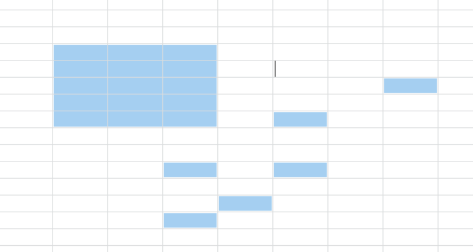
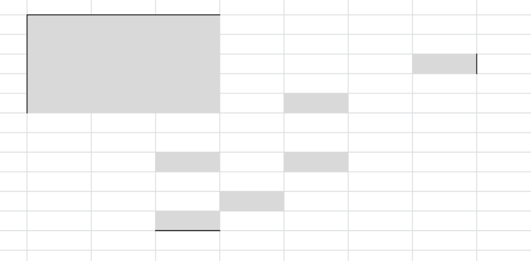

# 우클릭 메뉴 포지셔닝과 Multi Select에 따른 Border주기

#### 2021.03.15

> element.getBoundingClientRect()와 BFS 기초

프로젝트가 거의 막바지에 다다름에 따라 서버쪽 이슈는 크게 남지 않았고, FE 쪽에서 발생하는 결함을 계속해서 찾아내고 수정요청을 진행하고 있었다. 그와 동시에 프로젝트 기한을 맞추기 위해서, React에 대한 호기심 그리고 FE 개발자들과의 원할한 소통을 위해 React를 따로 공부 중에 있었다.

FE 개발자들과의 여러가지 사건사고(?)들은 프로젝트가 완전히 끝나면 회고하는 것으로 하고... 아무튼 몇 가지 결함사항들에 대해 FE 개발자 한 분이 계속해서 퍼블리셔의 지원이 없으면 할 수 없다고 얘기를 하였다. :imp: 이런 문제들이 몇 가지 더 있었으나 금일 해결한 두 가지를 기록해두고자 한다.

1. Custom 우클릭 메뉴의 위치 조정
2. Table에서 Ctrl로 비연속적인 선택을 했을 때, Border 주기

---

### 1. Custom 우클릭 메뉴의 위치 조정

Context Menu의 Positiong을 얘기하기 앞서 Front쪽 소스코드를 뜯어 보면서 한 가지 의문이 들었다.

> Context 메뉴를 만들 때 두 자아가 충돌했나...?

React기 때문에 이렇게 구성한건가..? 우클릭이 필요한 요소요소마다 Element들을 만들어 넣어 놨었고, 해당 Element에 우클릭을 했을 때 active class를 부여하는 식이었다. 대체 왜...?

독립적인 Component로 구성해서 상황에 맞게 내부 요소들을 변경해서 사용하고 커서 위치를 기반으로 좌표값만 수정해주면 될 것으로 생각했는데 구성이 참으로 이상했다. 추후 유지보수나 시간이 된다면 Context Menu와 관련한 것들은 싹 다 갈아엎어 버리고 싶은 기분이다.

아무튼 근본적인 원인은 처음 퍼블리싱이 나오고 난 후 시나리오가 변경되어 화면 구성이 다소 바뀌게 되었는데, 이 때 기존 퍼블리싱으로는 Context Menu의 위치를 잡아줄 수 없게 된 것이다(단독 Page로 구성된 항목들이 모두 Pop Up으로 변경되었다).

나름대로 잡아보신다고 FE 개발자가 잡았었으나 우클릭을 했을 때, 클릭한 위치와 Context Menu가 나오는 위치 사이에 이격이 있었고 이것이 너무 눈엣가시였다. 또한 창을 확대하거나 축소했을 때 우클릭을 하면 Context Menu는 저 멀리 떨어져 있었다.

코드를 뜯어 보니 clientX / clientY에 강제로 특정 픽셀 값을 빼서 때려박아 넣어놨더라...

```javascript
// ex)
const elem.current.style.left = e.clientX - 190 + 'px';
const elem.current.style.top = e.clientY - 70 + 'px';
```

해결을 하기 위해서는 퍼블리싱된 구조를 파악해야 했지만 그러기에는 시간이 부족했기에, fixed로 되어 있는 Context Menu의 position을 absolute로 변경, 부모 element의 position을 relative로 잡아 부모 Element로부터의 위치를 잡아주기로 했다.

e.clientX와 e.clientY를 통해 클릭이 된 위치는 파악할 수 있었고 부모 Element의 화면 상 절대적인 위치를 찾기 위해 getBoundingClientRect()를 사용했다.

```javascript
const parentClientRect = elem.current.parentElement.getBoundingClientRect();
const elem.current.style.left = e.clientX - parentClientRect.left + 'px';
const elem.current.style.top = e.clientY - parentClientRect.top + 'px';
```

요렇게 처리함에 따라, Context Menu는 이제 화면을 확대/축소해도 그리고 그냥 우클릭을 해도 클릭한 위치에 바로 나오게 되었다.

---

### 2. Table에서 Ctrl로 비연속적인 선택을 했을 때, Border 주기

Table에서 비연속적인 선택을 한다는 것은 아래 이미지와 같은 상황을 의미한다.



엑셀에서는 이미지와 같이 Ctrl로 비연속적인 선택을 했을 때 테두리가 쳐지지는 않지만 우리는 쳐져야했다. 하지만 기존에 FE 개발자가 만들어 놓은 Border는 굉장히 이상했다.. 위 이미지대로 선택 시, 아래의 이미지와 같이 Border가 만들어졌다.



간단하게 해결할 수 있을것 같아서 내가 하겠다고 했고, 기존 코드를 훼손하지 않는 선에서 해결하고자 했다.

Cell이 선택되어 있는 경우 Border Class를 부여하는 별도의 함수가 만들어져 있어서 해당 함수만 수정했다. 기존에는 min, max를 잡아서 class를 부여했기에 두 번째 이미지와 같은 현상이 발생하고 있었다.

좀 더 재밋게 수정하고 싶었지만 시간이 금이었기에... BFS나 DFS 알고리즘의 기초인 좌표 이동을 통해 해결했다.

```javascript
// 북 동 남 서
const dy = [-1, 0, 1, 0];
const dx = [0, 1, 0, -1];
for(let i = 0; i < 4; i++) {
    // 네 방향으로 진행했을 때의 Cell 이름이 선택된 Cell 배열에 없다면
    if(selectedCells.indexOf(cellNm) === -1) {
        // index의 방향으로 border class 부여
        ...
    }
}
```

문제는 쉽게 해결했으나 좋은 코드는 아니라고 생각한다. 인접한 Cell들이 연속적으로 선택될 경우 동일한 node를 반복해서 탐색하게 되기 때문이다. 조금 여유가 생길 때, 안그래도 쥐고있을 데이터가 많은 클라이언트에 조금이나마 부하를 줄이기 위해 개선된 코드로 적용해놔야겠다.
